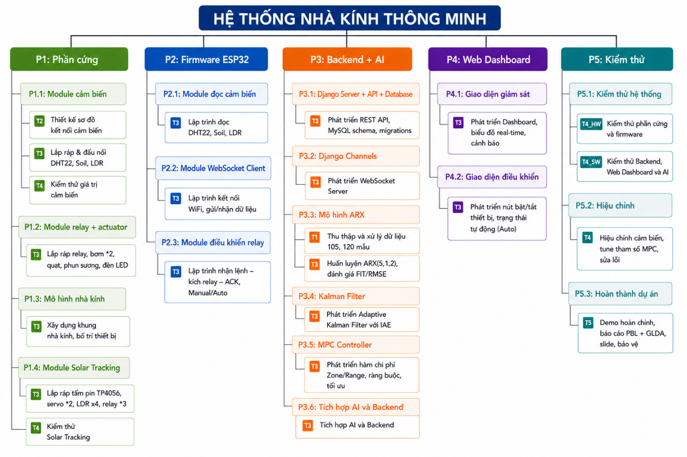

# CHƯƠNG 3: LIỆT KÊ CÔNG VIỆC DỰ ÁN

## 3.1 Tổng quan về WBS

WBS (Work Breakdown Structure — Cấu trúc phân rã công việc) là công cụ phân rã phạm vi dự án thành các công việc nhỏ hơn có thể quản lý được, có dạng cây phân cấp từ tổng thể đến chi tiết. WBS được xây dựng bằng cách kết hợp hai thành phần:

PBS (Product Breakdown Structure): Phân rã sản phẩm.

TBS (Task Breakdown Structure): Phân rã công việc.

WBS = PBS × TBS — Kết hợp danh sách sản phẩm và công việc thành WBS hoàn chỉnh.

## 3.2 Danh sách sản phẩm (PBS — Product Breakdown Structure)

### 3.2.1 Sản phẩm tổng: Hệ thống nhà kính thông minh

Sản phẩm tổng của dự án là “Hệ thống Nhà kính Thông minh (Smart Greenhouse)” — bao gồm phần cứng, phần mềm nhúng, backend + AI, web dashboard và tài liệu.

### 3.2.2 Sản phẩm con cấp 1

Danh sách sản phẩm con cấp 1

| Mã | Sản phẩm cấp 1 | Mô tả |
| --- | --- | --- |
| P1 | Phần cứng (Hardware) | Mạch điện, cảm biến, relay, actuator, mô hình nhà kính |
| P2 | Phần mềm nhúng (Firmware) | Chương trình trên ESP32 |
| P3 | Backend + AI | Server Django, mô hình ARX, Kalman, MPC |
| P4 | Web Dashboard | Giao diện ReactJS giám sát và điều khiển |
| P5 | Kiểm thử | Kiểm thử hệ thống, hiệu chỉnh, hoàn thành dự án |

### 3.2.3 Sản phẩm con cấp 2

Danh sách sản phẩm con cấp 2

| Mã | Sản phẩm cấp 2 | Thuộc cấp 1 |
| --- | --- | --- |
| P1.1 | Module cảm biến (DHT22, Soil, LDR) | P1 |
| P1.2 | Module relay + actuator (bơm, quạt, phun sương, đèn) | P1 |
| P1.3 | Mô hình nhà kính (khung, bố trí) | P1 |
| P1.4 | Module Solar Tracking (tấm pin, servo, LDR) | P1 |
| P2.1 | Module đọc cảm biến | P2 |
| P2.2 | Module WebSocket Client | P2 |
| P2.3 | Module điều khiển relay | P2 |
| P3.1 | Django Server + API + Database | P3 |
| P3.2 | Django Channels (WebSocket Server) | P3 |
| P3.3 | Mô hình ARX | P3 |
| P3.4 | Kalman Filter | P3 |
| P3.5 | MPC Controller | P3 |
| P4.1 | Giao diện giám sát (Dashboard, biểu đồ, cảnh báo) | P4 |
| P4.2 | Giao diện điều khiển (bật/tắt thiết bị, dự báo) | P4 |
| P5.1 | Kiểm thử hệ thống | P5 |
| P5.2 | Hiệu chỉnh | P5 |
| P5.3 | Hoàn thành dự án | P5 |

## 3.3 Danh sách công việc (TBS — Task Breakdown Structure)

### 3.3.1 Các công việc tổng

Danh sách công việc tổng

| Mã | Công việc tổng | Mô tả |
| --- | --- | --- |
| T1 | Phân tích yêu cầu | Khảo sát, xác định yêu cầu chức năng và phi chức năng |
| T2 | Thiết kế | Thiết kế kiến trúc, sơ đồ mạch, thiết kế DB, thiết kế UI |
| T3 | Phát triển | Lập trình firmware, backend, web, AI |
| T4 | Kiểm thử | Kiểm thử đơn vị, tích hợp, hệ thống |
| T5 | Hoàn thành | Hiệu chỉnh, báo cáo, bảo vệ đồ án |

### 3.3.2 Các công việc con chi tiết

T1 — Phân tích yêu cầu:

T1.1: Khảo sát các giải pháp nhà kính thông minh hiện có

T1.2: Xác định yêu cầu chức năng

T1.3: Xác định yêu cầu phi chức năng

T1.4: Xác định phạm vi và ràng buộc

T2 — Thiết kế:

T2.1: Thiết kế kiến trúc tổng thể (HW + SW)

T2.2: Thiết kế sơ đồ mạch điện

T2.3: Thiết kế giao thức truyền thông (WebSocket, JSON)

T2.4: Thiết kế cơ sở dữ liệu

T2.5: Thiết kế giao diện Web

T2.6: Thiết kế pipeline AI (ARX → Kalman → MPC)

T3 — Phát triển:

T3.1: Lắp ráp phần cứng (mạch, cảm biến, relay, Solar Tracking)

T3.2: Lập trình firmware ESP32

T3.3: Phát triển Backend Django + WebSocket Server

T3.4: Phát triển Web Dashboard (ReactJS)

T3.5: Huấn luyện mô hình ARX

T3.6: Phát triển Kalman Filter

T3.7: Phát triển MPC Controller

T3.8: Tích hợp AI vào Web

T4 — Kiểm thử:

T4.1: Kiểm thử phần cứng và firmware

T4.2: Kiểm thử Backend, Web và AI

T4.3: Kiểm thử tích hợp end-to-end

T5 — Hoàn thành:

T5.1: Hiệu chỉnh phần cứng và mô hình AI

T5.2: Hoàn thành báo cáo và bảo vệ đồ án

### 3.3.3 Mã hóa WBS

WBS sử dụng mã phân cấp dạng số với quy tắc: [Mã sản phẩm].[Mã công việc]

P3.T3.6 = Sản phẩm “Backend + AI” → Công việc “Phát triển Kalman Filter”

P1.T2.2 = Sản phẩm “Phần cứng” → Công việc “Thiết kế sơ đồ mạch”

Trong bảng WBS dưới đây, để đơn giản, mã WBS được đánh số tuần tự dạng WBS-XXX.

## 3.4 Bảng WBS hoàn chỉnh

WBS hoàn chỉnh

## 3.5 Kiểm soát các phiên bản WBS

Trong quá trình thực hiện dự án, WBS có thể được cập nhật khi có thay đổi phạm vi. Nguyên tắc kiểm soát phiên bản:

Không được hủy các phiên bản trước để quản lý các vấn đề nảy sinh do sự thay đổi.

Các phiên bản cần có số hiệu và ngày tháng.

Mỗi lần thay đổi cần được ghi nhận lý do và phê duyệt bởi PM.

Danh sách phiên bản WBS

| Phiên bản | Ngày | Thay đổi | Lý do |
| --- | --- | --- | --- |
| v1.0 | Tuần 2 | WBS ban đầu | Phân rã lần đầu sau phân tích yêu cầu |
| v1.1 | Tuần 5 | Thêm P3.4.T3 (Kalman Filter) | Quyết định dùng Adaptive Kalman |
| v1.2 | Tuần 7 | Thêm P4.2.T3 (Trang dự báo) | Yêu cầu bổ sung từ giảng viên |
