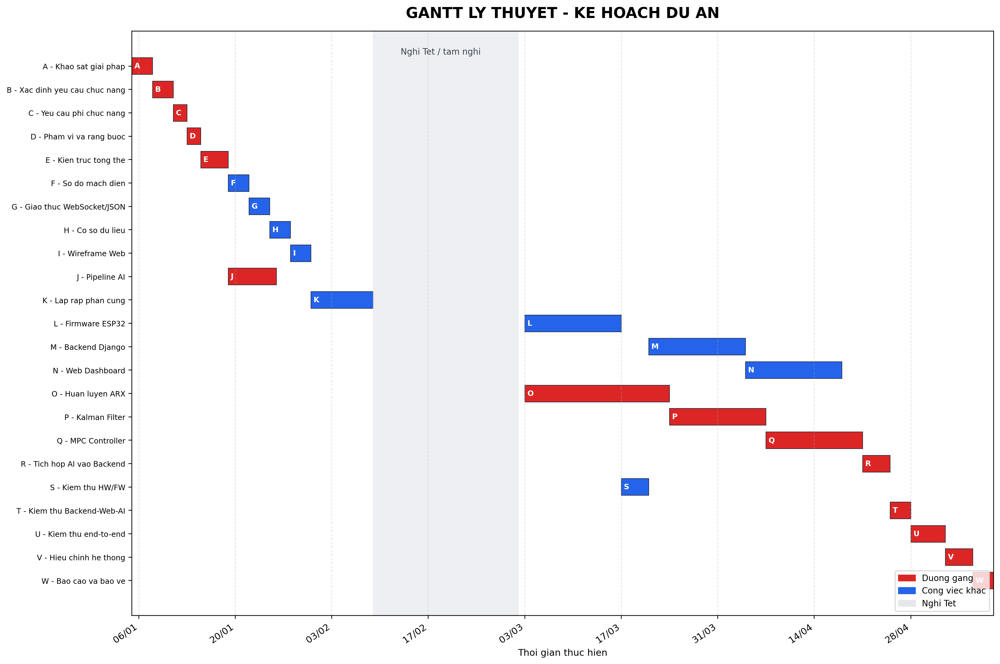
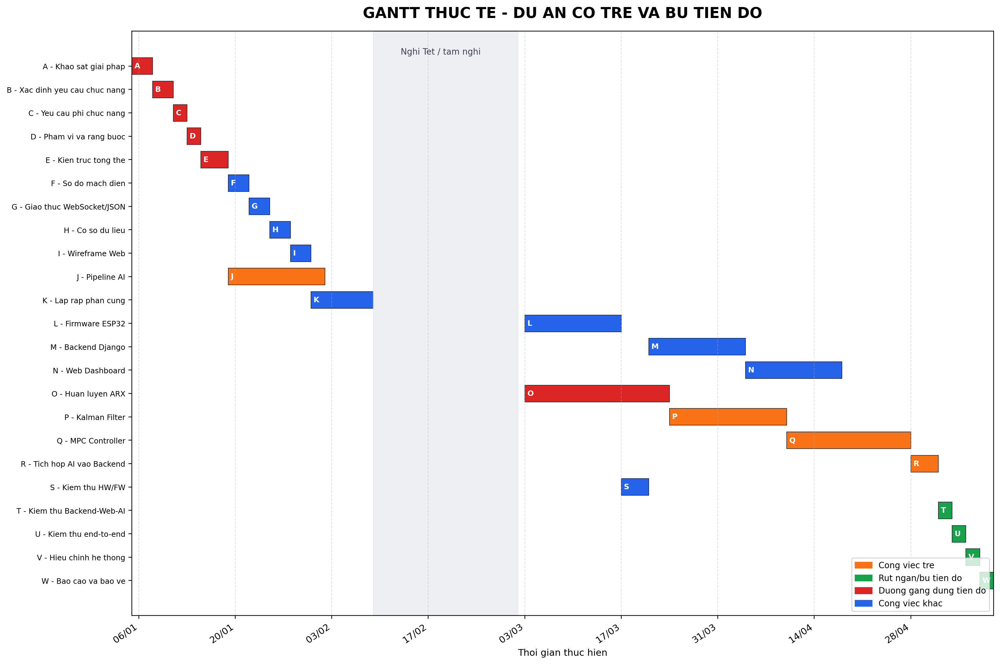

# CHƯƠNG 5: LẬP LỊCH BIỂU CHO DỰ ÁN

## 5.1 Mục đích của việc lập lịch biểu

Lập lịch biểu là quá trình sắp xếp các công việc trong WBS theo trình tự thời gian, xác định mối quan hệ phụ thuộc, thời điểm bắt đầu và kết thúc dự kiến, cũng như những công việc đòi hỏi sự tuân thủ tiến độ nghiêm ngặt.

Đối với dự án Hệ thống Nhà kính Thông minh, lịch biểu phục vụ các mục đích quản lý chủ yếu sau: xác định thứ tự thực hiện và quan hệ phụ thuộc giữa các công việc; nhận diện các hạng mục có thể triển khai song song nhằm tối ưu hóa thời gian; phát hiện các công việc nằm trên đường găng; đánh giá mức độ phân bổ và khả năng quá tải nguồn lực theo từng giai đoạn. Từ đó, nhóm có cơ sở để đánh giá tính khả thi của mục tiêu hoàn thành dự án trong vòng 15 tuần và chủ động điều chỉnh khi cần thiết.

## 5.2 Lập bảng hoạt động

### 5.2.1 Bảng hoạt động

Bảng 15. Bảng hoạt động của dự án.

| AC | WBS | Hoạt động | Công việc trước đó | Thời gian | Thời lượng |
|:--:|:---:|-----------|--------------------|-----------|:----------:|
| A | T1.1 | Khảo sát các giải pháp nhà kính thông minh hiện có | - | 05/01/2026 - 07/01/2026 | 3 ngày |
| B | T1.2 | Xác định yêu cầu chức năng | A | 08/01/2026 - 10/01/2026 | 3 ngày |
| C | T1.3 | Xác định yêu cầu phi chức năng | B | 11/01/2026 - 12/01/2026 | 2 ngày |
| D | T1.4 | Xác định phạm vi và ràng buộc | C | 13/01/2026 - 14/01/2026 | 2 ngày |
| E | T2.1 | Thiết kế kiến trúc tổng thể HW + SW | D | 15/01/2026 - 18/01/2026 | 4 ngày |
| F | T2.2 | Thiết kế sơ đồ mạch điện | E | 19/01/2026 - 21/01/2026 | 3 ngày |
| G | T2.3 | Thiết kế giao thức truyền thông WebSocket/JSON | E | 22/01/2026 - 24/01/2026 | 3 ngày |
| H | T2.4 | Thiết kế cơ sở dữ liệu | E | 25/01/2026 - 27/01/2026 | 3 ngày |
| I | T2.5 | Thiết kế giao diện Web wireframe/mockup | E | 28/01/2026 - 30/01/2026 | 3 ngày |
| J | T2.6 | Thiết kế pipeline AI ARX - Kalman - MPC | E | 19/01/2026 - 25/01/2026 | 7 ngày |
| K | T3.1 | Lắp ráp phần cứng mạch, cảm biến, relay, Solar Tracking | F | 31/01/2026 - 08/02/2026 | 9 ngày |
| L | T3.2 | Lập trình firmware ESP32 | K | 03/03/2026 - 16/03/2026 | 14 ngày |
| M | T3.3 | Phát triển Backend Django + WebSocket Server | G, H | 21/03/2026 - 03/04/2026 | 14 ngày |
| N | T3.4 | Phát triển Web Dashboard ReactJS | I | 04/04/2026 - 17/04/2026 | 14 ngày |
| O | T3.5 | Huấn luyện mô hình ARX | J | 03/03/2026 - 23/03/2026 | 21 ngày |
| P | T3.6 | Phát triển Kalman Filter | O, J | 24/03/2026 - 06/04/2026 | 14 ngày |
| Q | T3.7 | Phát triển MPC Controller | P | 07/04/2026 - 20/04/2026 | 14 ngày |
| R | T3.8 | Tích hợp AI vào Backend | M, Q | 21/04/2026 - 24/04/2026 | 4 ngày |
| S | T4.1 | Kiểm thử phần cứng và firmware | K, L | 17/03/2026 - 20/03/2026 | 4 ngày |
| T | T4.2 | Kiểm thử Backend, Web và AI | M, N, Q, R | 25/04/2026 - 27/04/2026 | 3 ngày |
| U | T4.3 | Kiểm thử tích hợp end-to-end | S, T | 28/04/2026 - 02/05/2026 | 5 ngày |
| V | T5.1 | Hiệu chỉnh phần cứng và mô hình AI | U | 03/05/2026 - 06/05/2026 | 4 ngày |
| W | T5.2 | Hoàn thành báo cáo và bảo vệ đồ án | V | 07/05/2026 - 10/05/2026 | 4 ngày |

Ghi chú: Khoảng thời gian từ 09/02/2026 đến 02/03/2026 là giai đoạn nghỉ Tết/nghỉ giữa tiến độ nên nhóm không bố trí công việc phát triển chính. Các công việc sau kỳ nghỉ bắt đầu lại từ ngày 03/03/2026.

### 5.2.2 Các công việc thực hiện song song

Bảng 16. Bảng các công việc thực hiện song song.

| Giai đoạn | Hoạt động song song | Nhân sự | Ý nghĩa lập lịch |
|-----------|---------------------|---------|------------------|
| 19/01 - 30/01 | F, G, H, I và J được triển khai sau khi hoàn thành thiết kế tổng thể E | A, B, C | Thiết kế phần cứng, truyền thông, cơ sở dữ liệu, giao diện và pipeline AI được chuẩn bị trong cùng giai đoạn thiết kế. |
| 03/03 - 16/03 | L chạy song song với O | A, B | B lập trình firmware trong khi A huấn luyện ARX sau giai đoạn nghỉ. |
| 17/03 - 23/03 | S và M bắt đầu khi L hoàn thành, đồng thời O tiếp tục hoàn tất | A, B | Kiểm thử phần cứng/firmware và phát triển backend được triển khai trong khi mô hình ARX hoàn thiện. |
| 24/03 - 17/04 | M, N chạy song song với P, Q | B, C | Backend/Web được phát triển cùng giai đoạn với Kalman/MPC để kịp tích hợp AI vào Backend. |
| 21/04 - 27/04 | R và T nối tiếp ngắn sau khi các module chính sẵn sàng | A, B, C | Tập trung tích hợp và kiểm thử module trước khi kiểm thử end-to-end. |

## 5.3 Sơ đồ ADM

ADM (Arrow Diagramming Method) biểu diễn công việc bằng mũi tên và thể hiện quan hệ trước - sau giữa các hoạt động.

Hình 6. Sơ đồ ADM

## 5.4 Sơ đồ Gantt

Bảng phân công thời gian

| ID | Hoạt động | Ngày bắt đầu | Ngày kết thúc | Thời lượng | Công việc trước đó |
|----|-----------|--------------|---------------|------------|--------------------|
| A | Khảo sát các giải pháp nhà kính thông minh hiện có | 05/01 | 07/01 | 3 | None |
| B | Xác định yêu cầu chức năng | 08/01 | 10/01 | 3 | A |
| C | Xác định yêu cầu phi chức năng | 11/01 | 12/01 | 2 | B |
| D | Xác định phạm vi và ràng buộc | 13/01 | 14/01 | 2 | C |
| E | Thiết kế kiến trúc tổng thể HW + SW | 15/01 | 18/01 | 4 | D |
| F | Thiết kế sơ đồ mạch điện | 19/01 | 21/01 | 3 | E |
| G | Thiết kế giao thức truyền thông WebSocket/JSON | 22/01 | 24/01 | 3 | E |
| H | Thiết kế cơ sở dữ liệu | 25/01 | 27/01 | 3 | E |
| I | Thiết kế giao diện Web wireframe/mockup | 28/01 | 30/01 | 3 | E |
| J | Thiết kế pipeline AI ARX - Kalman - MPC | 19/01 | 25/01 | 7 | E |
| K | Lắp ráp phần cứng mạch, cảm biến, relay, Solar Tracking | 31/01 | 08/02 | 9 | F |
| L | Lập trình firmware ESP32 | 03/03 | 16/03 | 14 | K |
| M | Phát triển Backend Django + WebSocket Server | 21/03 | 03/04 | 14 | G, H |
| N | Phát triển Web Dashboard ReactJS | 04/04 | 17/04 | 14 | I |
| O | Huấn luyện mô hình ARX | 03/03 | 23/03 | 21 | J |
| P | Phát triển Kalman Filter | 24/03 | 06/04 | 14 | O, J |
| Q | Phát triển MPC Controller | 07/04 | 20/04 | 14 | P |
| R | Tích hợp AI vào Backend | 21/04 | 24/04 | 4 | M, Q |
| S | Kiểm thử phần cứng và firmware | 17/03 | 20/03 | 4 | K, L |
| T | Kiểm thử Backend, Web và AI | 25/04 | 27/04 | 3 | M, N, Q, R |
| U | Kiểm thử tích hợp end-to-end | 28/04 | 02/05 | 5 | S, T |
| V | Hiệu chỉnh phần cứng và mô hình AI | 03/05 | 06/05 | 4 | U |
| W | Hoàn thành báo cáo và bảo vệ đồ án | 07/05 | 10/05 | 4 | V |

Từ bảng phân công thời gian, nhóm có thể xây dựng sơ đồ GANTT để trực quan hóa tiến độ thực hiện dự án. Sơ đồ GANTT giúp nhóm theo dõi các công việc được thực hiện song song, các công việc phụ thuộc lẫn nhau và các mốc cần hoàn thành đúng tiến độ.

Trên sơ đồ Gantt, khoảng trống từ 09/02/2026 đến 02/03/2026 thể hiện giai đoạn nghỉ Tết/nghỉ giữa tiến độ, không phải thiếu công việc trong lịch biểu.

Hình 7a. Gantt lý thuyết theo kế hoạch dự án

Trong quá trình thực hiện, dự án phát sinh trễ ở hai giai đoạn chính: thiết kế pipeline AI và phát triển bộ điều khiển MPC. Để không làm thay đổi mốc kết thúc dự án, nhóm rút ngắn thời gian kiểm thử module, kiểm thử tích hợp và hiệu chỉnh hệ thống ở giai đoạn cuối.

| Hoạt động | Kế hoạch | Thực tế | Ghi chú |
|-----------|----------|---------|---------|
| J - Thiết kế pipeline AI | 19/01 - 25/01 | 19/01 - 01/02 | Trễ do thiết kế AI/control phức tạp hơn dự kiến |
| P - Phát triển Kalman Filter | 24/03 - 06/04 | 24/03 - 09/04 | Kéo dài do cần xử lý nhiễu cảm biến |
| Q - Phát triển MPC Controller | 07/04 - 20/04 | 10/04 - 27/04 | Trễ do tuning tham số MPC |
| R - Tích hợp AI vào Backend | 21/04 - 24/04 | 28/04 - 01/05 | Bị dời theo tiến độ MPC |
| T - Kiểm thử Backend, Web và AI | 25/04 - 27/04 | 02/05 - 03/05 | Rút ngắn để bù tiến độ |
| U - Kiểm thử tích hợp end-to-end | 28/04 - 02/05 | 04/05 - 05/05 | Rút ngắn nhờ kiểm thử song song |
| V - Hiệu chỉnh phần cứng và mô hình AI | 03/05 - 06/05 | 06/05 - 07/05 | Rút ngắn các hạng mục hiệu chỉnh phụ |
| W - Hoàn thành báo cáo và bảo vệ đồ án | 07/05 - 10/05 | 08/05 - 10/05 | Dồn hoàn thiện báo cáo và demo |

Hình 7b. Gantt thực tế khi dự án bị trễ và bù tiến độ

## 5.5 Sơ đồ PDM

### 5.5.1 Thời gian dự trữ

Thời gian dự trữ (Slack/Float) là khoảng thời gian một hoạt động có thể bị trì hoãn mà không làm thay đổi ngày kết thúc dự án. Trong sơ đồ PDM, thời gian dự trữ được tính theo công thức:

Slack = LS - ES = LF - EF

Trong đó:

- ES (Earliest Start): thời điểm bắt đầu sớm nhất.
- EF (Earliest Finish): thời điểm kết thúc sớm nhất.
- LS (Latest Start): thời điểm bắt đầu muộn nhất mà không làm trễ dự án.
- LF (Latest Finish): thời điểm kết thúc muộn nhất mà không làm trễ dự án.

Nếu Slack = 0, hoạt động nằm trên đường găng. Nếu Slack > 0, hoạt động có thể trễ trong giới hạn Slack mà chưa làm thay đổi mốc kết thúc dự án.

| Hoạt động | ES | EF | LS | LF | Thời lượng | Slack | Nhận xét |
|-----------|----|----|----|----|------------|-------|----------|
| A | 0 | 3 | 0 | 3 | 3 | 0 | Nằm trên đường găng. |
| B | 3 | 6 | 3 | 6 | 3 | 0 | Nằm trên đường găng. |
| C | 6 | 8 | 6 | 8 | 2 | 0 | Nằm trên đường găng. |
| D | 8 | 10 | 8 | 10 | 2 | 0 | Nằm trên đường găng. |
| E | 10 | 14 | 10 | 14 | 4 | 0 | Nằm trên đường găng. |
| F | 14 | 17 | 47 | 50 | 3 | 33 | Có thể trễ tối đa 33 ngày. |
| G | 14 | 17 | 39 | 42 | 3 | 25 | Có thể trễ tối đa 25 ngày. |
| H | 14 | 17 | 39 | 42 | 3 | 25 | Có thể trễ tối đa 25 ngày. |
| I | 14 | 17 | 53 | 56 | 3 | 39 | Có thể trễ tối đa 39 ngày. |
| J | 14 | 21 | 14 | 21 | 7 | 0 | Nằm trên đường găng. |
| K | 17 | 26 | 50 | 59 | 9 | 33 | Có thể trễ tối đa 33 ngày. |
| L | 26 | 40 | 59 | 73 | 14 | 33 | Có thể trễ tối đa 33 ngày. |
| M | 17 | 31 | 42 | 56 | 14 | 25 | Có thể trễ tối đa 25 ngày. |
| N | 31 | 45 | 56 | 70 | 14 | 25 | Có thể trễ tối đa 25 ngày. |
| O | 21 | 42 | 21 | 42 | 21 | 0 | Nằm trên đường găng. |
| P | 42 | 56 | 42 | 56 | 14 | 0 | Nằm trên đường găng. |
| Q | 56 | 70 | 56 | 70 | 14 | 0 | Nằm trên đường găng. |
| R | 70 | 74 | 70 | 74 | 4 | 0 | Nằm trên đường găng. |
| S | 40 | 44 | 73 | 77 | 4 | 33 | Có thể trễ tối đa 33 ngày. |
| T | 74 | 77 | 74 | 77 | 3 | 0 | Nằm trên đường găng. |
| U | 77 | 82 | 77 | 82 | 5 | 0 | Nằm trên đường găng. |
| V | 82 | 86 | 82 | 86 | 4 | 0 | Nằm trên đường găng. |
| W | 86 | 90 | 86 | 90 | 4 | 0 | Mốc cuối dự án, không có dự trữ. |

### 5.5.2 Sơ đồ PDM của dự án

Hình 8. Sơ đồ PDM của dự án

## 5.6 Đường găng và mốc kiểm soát

### 5.6.1 Đường găng

Đường găng được xác định theo chuỗi công việc sau:

A → B → C → D → E → J → O → P → Q → R → T → U → V → W

Chuỗi này bao gồm các công việc có thời gian dự trữ bằng 0. Trong đó, nhóm phân tích yêu cầu và thiết kế tổng thể tạo nền tảng cho toàn bộ dự án; J, O, P và Q là chuỗi thiết kế pipeline AI, huấn luyện ARX, phát triển Kalman Filter và MPC Controller; R, T, U, V và W nằm ở giai đoạn tích hợp, kiểm thử, hiệu chỉnh và hoàn thành. Bất kỳ sự chậm trễ nào trên chuỗi này đều có thể ảnh hưởng trực tiếp đến thời điểm kết thúc dự án.

### 5.6.2 Mốc kiểm soát dự án

Bảng 17. Bảng mốc kiểm soát dự án

| Mốc | Thời điểm | Hoạt động liên quan | Kết quả cần đạt |
|-----|-----------|---------------------|-----------------|
| M1 | Tuần 1 | A, B | Hoàn thành khảo sát giải pháp và xác định yêu cầu chức năng. |
| M2 | Tuần 2 | C, D | Hoàn thành yêu cầu phi chức năng, phạm vi và ràng buộc dự án. |
| M3 | Tuần 3–4 | E, F, G, H, I, J | Hoàn thành thiết kế kiến trúc, mạch, giao thức, database, giao diện và pipeline AI. |
| M4 | Tuần 5 | K | Prototype phần cứng được lắp ráp. |
| M5 | Tuần 7 | L, O | Firmware ESP32 hoạt động và mô hình ARX được huấn luyện. |
| M6 | Tuần 9 | M, P | Backend/WebSocket Server và Kalman Filter sẵn sàng. |
| M7 | Tuần 12 | N, Q | Web Dashboard và MPC Controller hoàn thành. |
| M8 | Tuần 13 | R, T | Pipeline AI/control được tích hợp và kiểm thử module. |
| M9 | Tuần 14 | U, V | Kiểm thử end-to-end và hiệu chỉnh hệ thống hoàn thành. |
| M10 | Tuần 15 | W | Báo cáo, slide và kịch bản demo sẵn sàng. |
