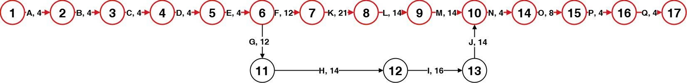
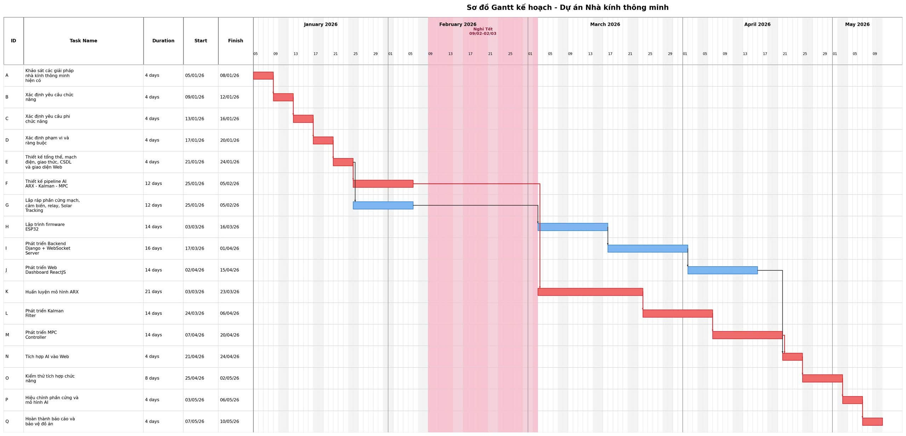
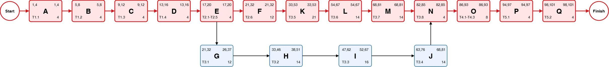

# CHƯƠNG 5: LẬP LỊCH BIỂU CHO DỰ ÁN

## 5.1 Mục đích của việc lập lịch biểu

Lập lịch biểu là quá trình sắp xếp các công việc trong WBS theo trình tự thời gian, xác định mối quan hệ phụ thuộc, thời điểm bắt đầu và kết thúc dự kiến, cũng như những công việc đòi hỏi sự tuân thủ tiến độ nghiêm ngặt.

Đối với dự án Hệ thống Nhà kính Thông minh, lịch biểu phục vụ các mục đích quản lý chủ yếu sau: xác định thứ tự thực hiện và quan hệ phụ thuộc giữa các công việc; nhận diện các hạng mục có thể triển khai song song nhằm tối ưu hóa thời gian; phát hiện các công việc nằm trên đường găng; đánh giá mức độ phân bổ và khả năng quá tải nguồn lực theo từng giai đoạn. Từ đó, nhóm có cơ sở để đánh giá tính khả thi của mục tiêu hoàn thành dự án trong vòng 15 tuần và chủ động điều chỉnh khi cần thiết.

## 5.2 Lập bảng hoạt động

Bảng hoạt động của dự án.

| AC | WBS | Hoạt động | Công việc trước đó | Thời gian | Thời lượng |
| --- | --- | --- | --- | --- | --- |
| A | T1.1 | Khảo sát các giải pháp nhà kính thông minh hiện có | - | 05/01/2026 - 08/01/2026 | 4 ngày |
| B | T1.2 | Xác định yêu cầu chức năng | A | 09/01/2026 - 12/01/2026 | 4 ngày |
| C | T1.3 | Xác định yêu cầu phi chức năng | B | 13/01/2026 - 16/01/2026 | 4 ngày |
| D | T1.4 | Xác định phạm vi và ràng buộc | C | 17/01/2026 - 20/01/2026 | 4 ngày |
| E | T2.1- 2.5 | Thiết kế kiến trúc tổng thể HW + SW | D | 21/01/2026 - 24/01/2026 | 4 ngày |
| F | T2.6 | Thiết kế pipeline AI ARX - Kalman - MPC | E | 25/01/2026 - 05/02/2026 | 12 ngày |
| G | T3.1 | Lắp ráp phần cứng mạch, cảm biến, relay, Solar Tracking | E | 25/01/2026 - 05/02/2026 | 12 ngày |
| H | T3.2 | Lập trình firmware ESP32 | G | 03/03/2026 - 16/03/2026 | 14 ngày |
| I | T3.3 | Phát triển Backend Django + WebSocket Server | H | 17/03/2026 - 01/04/2026 | 16 ngày |
| J | T3.4 | Phát triển Web Dashboard ReactJS | I | 02/04/2026 - 15/04/2026 | 14 ngày |
| K | T3.5 | Huấn luyện mô hình ARX | F | 03/03/2026 - 23/03/2026 | 21 ngày |
| L | T3.6 | Phát triển Kalman Filter | K | 24/03/2026 - 06/04/2026 | 14 ngày |
| M | T3.7 | Phát triển MPC Controller | L | 07/04/2026 - 20/04/2026 | 14 ngày |
| N | T3.8 | Tích hợp AI vào Web | J, M | 21/04/2026 - 24/04/2026 | 4 ngày |
| O | T4.1 – 4.3 | Kiểm thử tích hợp chức năng | N | 25/04/2026 - 02/05/2026 | 8 ngày |
| P | T5.1 | Hiệu chỉnh phần cứng và mô hình AI | O | 03/05/2026 - 06/05/2026 | 4 ngày |
| Q | T5.2 | Hoàn thành báo cáo và bảo vệ đồ án | P | 07/05/2026 - 10/05/2026 | 4 ngày |

Ghi chú: Khoảng thời gian từ 09/02/2026 đến 02/03/2026 là giai đoạn nghỉ Tết/nghỉ giữa tiến độ nên nhóm không bố trí công việc phát triển chính. Các công việc sau kỳ nghỉ bắt đầu lại từ ngày 03/03/2026.

## 5.3 Sơ đồ ADM

ADM (Arrow Diagramming Method) biểu diễn công việc bằng mũi tên và thể hiện quan hệ trước - sau giữa các hoạt động.

Sơ đồ ADM

## 5.4 Sơ đồ Gantt

Gantt tổng quan theo tuần làm việc

## 5.5 Sơ đồ PDM

### 5.5.1 Thời gian dự trữ

Thời gian dự trữ (Slack/Float) là khoảng thời gian một hoạt động có thể bị trì hoãn mà không làm thay đổi ngày kết thúc dự án. Trong sơ đồ PDM, thời gian dự trữ được tính theo công thức:

Slack = LS - ES = LF - EF

Trong đó:

ES (Earliest Start): thời điểm bắt đầu sớm nhất.

EF (Earliest Finish): thời điểm kết thúc sớm nhất.

LS (Latest Start): thời điểm bắt đầu muộn nhất mà không làm trễ dự án.

LF (Latest Finish): thời điểm kết thúc muộn nhất mà không làm trễ dự án.

Nếu Slack = 0, hoạt động nằm trên đường găng. Nếu Slack > 0, hoạt động có thể trễ trong giới hạn Slack mà chưa làm thay đổi mốc kết thúc dự án.

Thời gian dự trữ

| AC | Công việc trước | Công việc sau | Dur | ES | EF | LS | LF | Slack |
| --- | --- | --- | --- | --- | --- | --- | --- | --- |
| A | Start | B | 4 | 1 | 4 | 1 | 4 | 0 |
| B | A | C | 4 | 5 | 8 | 5 | 8 | 0 |
| C | B | D | 4 | 9 | 12 | 9 | 12 | 0 |
| D | C | E | 4 | 13 | 16 | 13 | 16 | 0 |
| E | D | F, G | 4 | 17 | 20 | 17 | 20 | 0 |
| F | E | K | 12 | 21 | 32 | 21 | 32 | 0 |
| G | E | H | 12 | 21 | 32 | 26 | 37 | 5 |
| H | G | I | 14 | 33 | 46 | 38 | 51 | 5 |
| I | H | J | 16 | 47 | 62 | 52 | 67 | 5 |
| J | I | N | 14 | 63 | 76 | 68 | 81 | 5 |
| K | F | L | 21 | 33 | 53 | 33 | 53 | 0 |
| L | K | M | 14 | 54 | 67 | 54 | 67 | 0 |
| M | L | N | 14 | 68 | 81 | 68 | 81 | 0 |
| N | J, M | O | 4 | 82 | 85 | 82 | 85 | 0 |
| O | N | P | 8 | 86 | 93 | 86 | 93 | 0 |
| P | O | Q | 4 | 94 | 97 | 94 | 97 | 0 |
| Q | P | Finish | 4 | 98 | 101 | 98 | 101 | 0 |

### 5.5.2 Sơ đồ PDM của dự án

Sơ đồ PDM của dự án
