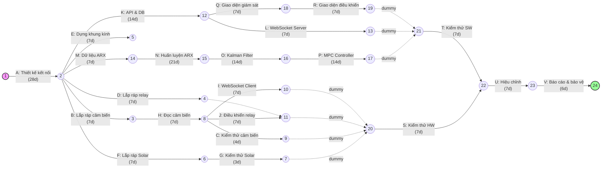
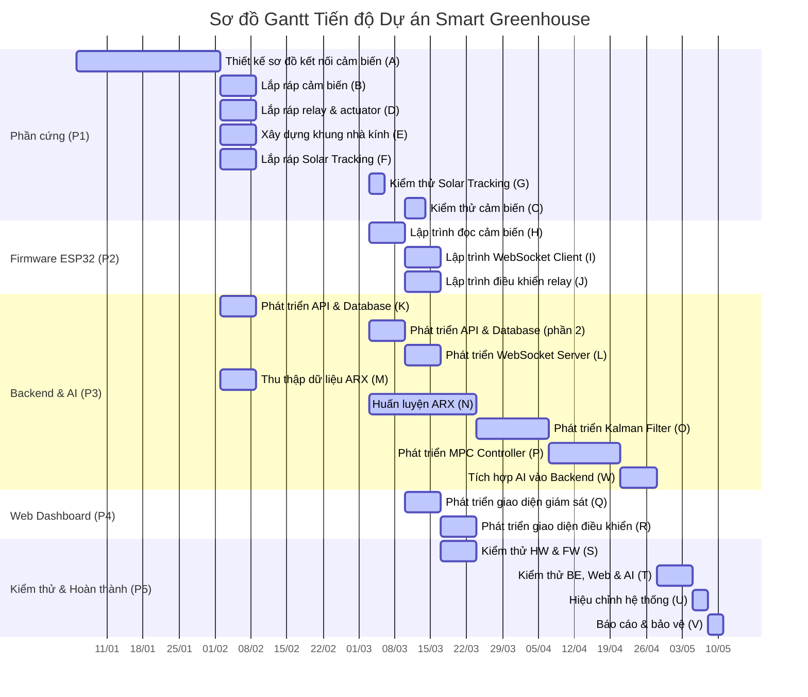
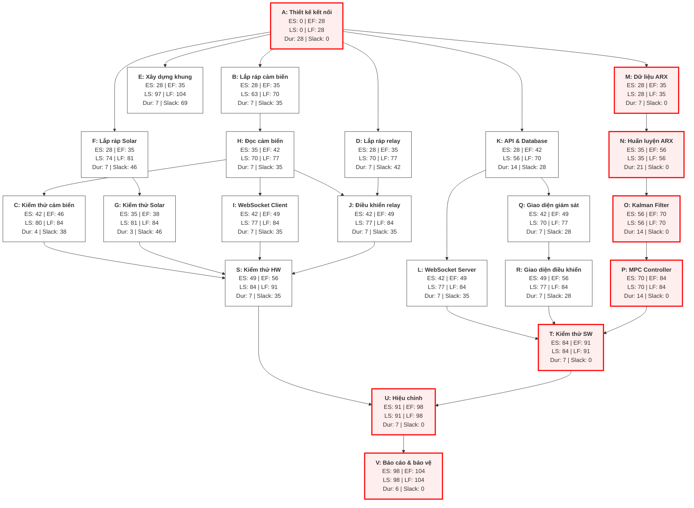

# CHƯƠNG 6: LẬP LỊCH BIỂU CHO DỰ ÁN

---

## 6.1 Mục đích của việc lập lịch biểu

Lập lịch biểu là quá trình sắp xếp các công việc trong WBS theo trình tự thời gian, xác định mối quan hệ phụ thuộc, thời điểm bắt đầu và kết thúc dự kiến, cũng như những công việc đòi hỏi sự tuân thủ tiến độ nghiêm ngặt.

Đối với dự án Hệ thống Nhà kính Thông minh, lịch biểu phục vụ các mục đích quản lý chủ yếu sau:

- Xác định thứ tự thực hiện và quan hệ phụ thuộc giữa các công việc.
- Nhận diện các hạng mục có thể triển khai song song nhằm tối ưu hóa thời gian.
- Phát hiện các công việc nằm trên đường găng (Critical Path).
- Đánh giá mức độ phân bổ và khả năng quá tải nguồn lực theo từng giai đoạn.

Từ đó, nhóm có cơ sở để đánh giá tính khả thi của mục tiêu hoàn thành dự án trong vòng 15 tuần và chủ động điều chỉnh khi có sự cố phát sinh.

---

## 6.2 Lập bảng hoạt động

### 6.2.1 Bảng hoạt động của dự án

Bảng hoạt động dưới đây được xây dựng dựa trên **23 công việc chi tiết từ WBS** (Chương 3), xác định các mối quan hệ trước - sau, thời gian thực hiện (quy đổi sang ngày lịch làm việc thực tế) và phân công trách nhiệm:

**Bảng 16. Bảng hoạt động của dự án (23 công việc WBS)**

|       Mã WBS       | Hoạt động                             |      Công việc trước đó      |    Thời gian thực hiện    | Thời lượng | Nhân sự chính | Kết quả bàn giao                          |
| :------------------: | ---------------------------------------- | :--------------------------------: | :---------------------------: | :-----------: | :--------------: | -------------------------------------------- |
|  **A**  | Thiết kế sơ đồ kết nối cảm biến |                 -                 |    05/01/2026 - 01/02/2026    |   28 ngày   |       Sỹ       | Sơ đồ nguyên lý kết nối cảm biến    |
|  **B**  | Lắp ráp & đấu nối cảm biến        |              A              |    02/02/2026 - 08/02/2026    |    7 ngày    |       Sỹ       | Cụm cảm biến được đấu nối           |
|  **C**  | Kiểm thử cảm biến                    |              H              |    10/03/2026 - 13/03/2026    |    4 ngày    |       Sỹ       | Báo cáo thông số cảm biến              |
|  **D**  | Lắp ráp relay & actuator               |              A              |    02/02/2026 - 08/02/2026    |    7 ngày    |       Sỹ       | Khối điều khiển công suất              |
|  **E**  | Xây dựng khung nhà kính              |              A              |    02/02/2026 - 08/02/2026    |    7 ngày    |    Trí, Sỹ    | Khung mô hình nhà kính                   |
|  **F**  | Lắp ráp Solar Tracking                 |              A              |    02/02/2026 - 08/02/2026    |    7 ngày    |       Sỹ       | Cơ cấu cơ khí Solar Tracking             |
|  **G**  | Kiểm thử Solar Tracking                |              F              |    03/03/2026 - 05/03/2026    |    3 ngày    |       Sỹ       | Báo cáo hoạt động Solar Tracking        |
|  **H**  | Lập trình đọc cảm biến             |              B              |    03/03/2026 - 09/03/2026    |    7 ngày    |       Sỹ       | Code firmware đọc cảm biến               |
|  **I**  | Lập trình WebSocket Client             |              H              |    10/03/2026 - 16/03/2026    |    7 ngày    |       Sỹ       | Code kết nối WebSocket Client              |
|  **J**  | Lập trình điều khiển relay          |          D, H          |    10/03/2026 - 16/03/2026    |    7 ngày    |       Sỹ       | Code đóng ngắt relay tự động           |
|  **K**  | Phát triển API & Database              |              A              | 02/02 - 08/02 & 03/03 - 09/03 |   14 ngày   |       Sỹ       | Database Schema & API Docs                   |
|  **L**  | Phát triển WebSocket Server            |              K              |    10/03/2026 - 16/03/2026    |    7 ngày    |       Sỹ       | Socket Server Django Channels                |
|  **M**  | Thu thập dữ liệu ARX                  |              A              |    02/02/2026 - 08/02/2026    |    7 ngày    |       Trí       | Tập dữ liệu ngõ vào/ra (CSV)            |
|  **N**  | Huấn luyện ARX                         |              M              |    03/03/2026 - 23/03/2026    |   21 ngày   |       Trí       | Trọng số mô hình ARX                     |
|  **O**  | Phát triển Kalman Filter               |              N              |    24/03/2026 - 06/04/2026    |   14 ngày   |       Sinh       | Code thuật toán ước lượng trạng thái |
|  **P**  | Phát triển MPC Controller              |              O              |    07/04/2026 - 20/04/2026    |   14 ngày   |       Sinh       | Code thuật toán điều khiển tối ưu     |
|  **W**  | Tích hợp AI vào Backend              |           L, P              |    21/04/2026 - 27/04/2026    |    7 ngày    |   Sỹ, Sinh   | API dự báo real-time, tích hợp ARX/Kalman/MPC vào Django |
|  **Q**  | Phát triển giao diện giám sát       |              K              |    10/03/2026 - 16/03/2026    |    7 ngày    |       Sỹ       | Dashboard hiển thị biểu đồ              |
|  **R**  | Giao diện điều khiển                 |              Q              |    17/03/2026 - 23/03/2026    |    7 ngày    |       Sỹ       | Dashboard gửi lệnh điều khiển           |
| **S** | Kiểm thử HW & FW                       | C, G, I, J |    17/03/2026 - 23/03/2026    |    7 ngày    |       Sỹ       | Báo cáo kiểm thử thiết bị              |
| **T** | Kiểm thử BE, Web & AI                  |     L, R, W     |    28/04/2026 - 04/05/2026    |    7 ngày    | Trí, Sỹ, Sinh | Báo cáo kiểm thử tích hợp phần mềm   |
|  **U**  | Hiệu chỉnh hệ thống                  |       S, T       |    05/05/2026 - 07/05/2026    |    3 ngày    | Trí, Sỹ, Sinh | Hệ thống vận hành đồng bộ             |
|  **V**  | Báo cáo & bảo vệ                     |              U              |    08/05/2026 - 10/05/2026    |    3 ngày    | Trí, Sỹ, Sinh | Báo cáo hoàn chỉnh & Slide               |

*Ghi chú: Khoảng thời gian từ 09/02/2026 đến 02/03/2026 là kỳ nghỉ Tết Nguyên Đán (3 tuần) nên không có hoạt động phát triển nào được lên lịch.*

### 6.2.2 Các công việc thực hiện song song

Để tối ưu hóa thời gian và tận dụng nguồn lực chuyên môn hóa của 3 thành viên, lịch trình được thiết kế với nhiều hạng mục song song:

**Bảng 17. Bảng các công việc thực hiện song song**

| Giai đoạn             | Hoạt động song song                                                                                                                                                    | Nhân sự | Ý nghĩa lập lịch                                                                                                                           |
| ----------------------- | ------------------------------------------------------------------------------------------------------------------------------------------------------------------------- | --------- | ---------------------------------------------------------------------------------------------------------------------------------------------- |
| **02/02 - 08/02** | Lắp ráp phần cứng (B - F) song song với API & DB (K) và thu thập dữ liệu ARX (M).                                                        | Sỹ, Trí | Tận dụng thời gian trước Tết để chuẩn bị phần cứng thô và dữ liệu thô phục vụ lập trình và AI sau Tết.                  |
| **03/03 - 09/03** | Lập trình firmware ESP32 (H) song song với huấn luyện ARX (N) và hoàn tất API (K).                                                              | Sỹ, Trí | Sỹ viết code ESP32 trong khi Trí chạy huấn luyện mô hình ARX trên máy chủ.                                                          |
| **10/03 - 16/03** | Lập trình WebSocket Client/Relay (I, J) song song với WebSocket Server (L), thiết kế UI giám sát (Q) và chạy huấn luyện ARX (N). | Sỹ, Trí | Kết nối truyền thông IoT được hoàn thiện đồng thời cả phía client và server.                                                    |
| **17/03 - 23/03** | Kiểm thử phần cứng & firmware (S) song song với giao diện điều khiển (R) và huấn luyện ARX (N).                                          | Sỹ, Trí | Sỹ hoàn thiện và chốt kiểm thử phần cứng và giao diện điều khiển trước khi bước sang giai đoạn tích hợp thuật toán AI. |
| **24/03 - 20/04** | Phát triển thuật toán Kalman Filter (O) và MPC (P) chạy song song với việc hoàn thành hệ thống backend/web.                                       | Sinh      | Nhánh AI/Control tập trung phát triển sâu thuật toán khi các kênh truyền thông IoT đã ổn định.                                 |

---

## 6.3 Sơ đồ ADM

ADM (Arrow Diagramming Method) biểu diễn công việc bằng mũi tên và thể hiện quan hệ trước - sau giữa các hoạt động. Dưới đây là sơ đồ ADM biểu diễn tiến trình công việc của dự án:

**Hình 6. Sơ đồ ADM của dự án**

---

## 6.4 Sơ đồ Gantt

Dưới đây là sơ đồ GANTT tổng quan trực quan hóa tiến độ thực hiện dự án theo tuần làm việc, bao gồm cả khoảng thời gian nghỉ Tết Nguyên Đán:

**Hình 7. Sơ đồ Gantt tổng quan theo tuần làm việc**

---

## 6.5 Sơ đồ PDM

### 6.5.1 Thời gian dự trữ

Thời gian dự trữ (Slack/Float) là khoảng thời gian một hoạt động có thể bị trì hoãn mà không làm thay đổi ngày kết thúc dự án. Trong sơ đồ PDM, thời gian dự trữ được tính theo công thức:

$$
\text{Slack} = \text{LS} - \text{ES} = \text{LF} - \text{EF}
$$

Dưới đây là bảng tính toán các thông số thời gian của 23 hoạt động (chưa bao gồm 21 ngày nghỉ Tết):

**Bảng 18. Bảng tính toán thời gian dự trữ của các hoạt động**

|       Mã WBS       | ES (ngày) | EF (ngày) | LS (ngày) | LF (ngày) | Thời lượng | Slack (ngày) | Nhận xét                        |
| :------------------: | :--------: | :--------: | :--------: | :--------: | :-----------: | :-----------: | --------------------------------- |
|  **A**  |     0     |     28     |     0     |     28     |      28      |       0       | Nằm trên đường găng         |
|  **B**  |     28     |     35     |     63     |     70     |       7       |      35      | Dự trữ lớn, thuộc nhánh phụ |
|  **C**  |     42     |     46     |     80     |     84     |       4       |      38      | Thuộc nhánh phụ phần cứng    |
|  **D**  |     28     |     35     |     70     |     77     |       7       |      42      | Nhánh phụ lắp ráp công suất |
|  **E**  |     28     |     35     |     97     |    104    |       7       |      69      | Nhánh phụ dựng khung kính     |
|  **F**  |     28     |     35     |     74     |     81     |       7       |      46      | Nhánh phụ lắp ráp Solar       |
|  **G**  |     35     |     38     |     81     |     84     |       3       |      46      | Nhánh phụ kiểm thử Solar      |
|  **H**  |     35     |     42     |     70     |     77     |       7       |      35      | Nhánh phụ lập trình firmware  |
|  **I**  |     42     |     49     |     77     |     84     |       7       |      35      | Nhánh phụ kết nối WebSocket   |
|  **J**  |     42     |     49     |     77     |     84     |       7       |      35      | Nhánh phụ điều khiển relay   |
|  **K**  |     28     |     42     |     56     |     70     |      14      |      28      | Nhánh phụ Backend               |
|  **L**  |     42     |     49     |     77     |     84     |       7       |      35      | Nhánh phụ WebSocket Server      |
|  **M**  |     28     |     35     |     28     |     35     |       7       |       0       | Nằm trên đường găng         |
|  **N**  |     35     |     56     |     35     |     56     |      21      |       0       | Nằm trên đường găng         |
|  **O**  |     56     |     70     |     56     |     70     |      14      |       0       | Nằm trên đường găng         |
|  **P**  |     70     |     84     |     70     |     84     |      14      |       0       | Nằm trên đường găng         |
|  **Q**  |     42     |     49     |     70     |     77     |       7       |      28      | Nhánh phụ giao diện Web        |
|  **R**  |     49     |     56     |     77     |     84     |       7       |      28      | Nhánh phụ điều khiển Web     |
| **S** |     49     |     56     |     84     |     91     |       7       |      35      | Kiểm thử tích hợp phần cứng |
| **T** |     84     |     91     |     84     |     91     |       7       |       0       | Nằm trên đường găng         |
|  **U**  |     91     |     98     |     91     |     98     |       7       |       0       | Nằm trên đường găng         |
|  **V**  |     98     |    104    |     98     |    104    |       6       |       0       | Nằm trên đường găng         |

### 6.5.2 Sơ đồ PDM của dự án

Sơ đồ PDM (Precedence Diagramming Method - Phương pháp sơ đồ tiền tiến) dưới đây trực quan hóa mối quan hệ giữa các nút công việc và biểu diễn đường găng bằng các nút màu đỏ:

**Hình 8. Sơ đồ PDM của dự án**

---

## 6.6 Đường găng và mốc kiểm soát

### 6.6.1 Đường găng (Critical Path)

Đường găng được xác định theo chuỗi công việc sau:

$$
\mathbf{A \rightarrow M \rightarrow N \rightarrow O \rightarrow P \rightarrow T \rightarrow U \rightarrow V}
$$

Chuỗi này bao gồm các nhóm công việc có mối liên kết chặt chẽ và thời gian dự trữ thấp nhất trong toàn dự án ($\text{Slack} = 0$).

- **A (Thiết kế kết nối cảm biến - 28 ngày):** Đóng vai trò là mốc bản lề cho toàn bộ công việc thiết kế, phân tích hệ thống ban đầu, quyết định toàn bộ đầu ra của phần cứng, phần mềm và thuật toán.
- **M và N (Thu thập dữ liệu và huấn luyện ARX):** Là nền tảng bắt buộc để xây dựng mô hình toán học của hệ thống nhà kính. Bất kỳ sự chậm trễ nào ở đây sẽ làm trễ toàn bộ quy trình thiết kế bộ lọc Kalman và MPC tiếp theo.
- **O và P (Phát triển Kalman và MPC):** Là lõi điều khiển thông minh của dự án, quyết định tính khả thi của hệ thống và bắt buộc phải hoàn thành trước khi tiến hành kiểm thử phần mềm tích hợp.
- **Các công việc kiểm thử tích hợp (T), hiệu chỉnh (U) và báo cáo bảo vệ (V)** nằm ở cuối dự án, không có thời gian dự trữ và bất kỳ sự trễ hạn nào tại đây đều làm trễ ngày bảo vệ dự án.

### 6.6.2 Mốc kiểm soát dự án (Milestones)

Các mốc kiểm soát dự án được xác định lại dựa trên tiến độ của 23 hoạt động WBS:

**Bảng 19. Bảng mốc kiểm soát dự án**

|     Mốc     | Thời điểm |  Hoạt động liên quan  | Kết quả cần đạt                                                                              |
| :-----------: | :----------: | :------------------------: | ------------------------------------------------------------------------------------------------- |
| **M1** |   Tuần 4   |          A          | Hồ sơ thiết kế kết nối cảm biến và sơ đồ nguyên lý hoàn thành.                    |
| **M2** |   Tuần 5   | B - F, M | Lắp ráp cơ khí thô phần cứng hoàn tất và thu thập xong tập dữ liệu mẫu.            |
| **M3** |   Tuần 6   |          H          | ESP32 đọc thành công và chính xác các giá trị từ cảm biến vật lý.                  |
| **M4** |   Tuần 7   | I - J, L | Kênh truyền thông WebSocket hai chiều client-server được kết nối ổn định.             |
| **M5** |   Tuần 8   |      N, R      | Mô hình ARX được huấn luyện hoàn tất; giao diện điều khiển sẵn sàng.               |
| **M6** |   Tuần 10   |          O          | Bộ lọc Kalman ước lượng trạng thái hoạt động chính xác trên mô phỏng.             |
| **M7** |   Tuần 12   |          P          | Bộ điều khiển MPC tính toán được tín hiệu tối ưu trên mô phỏng.                   |
| **M8** |   Tuần 13   |         T         | Toàn bộ backend, frontend và thuật toán tích hợp thành công, hoàn thành kiểm thử SW. |
| **M9** |   Tuần 14   |          U          | Toàn bộ hệ thống (HW, FW, SW, AI) được hiệu chỉnh chạy thực tế trơn tru.             |
| **M10** |   Tuần 15   |          V          | Báo cáo hoàn chỉnh và slide thuyết trình sẵn sàng phục vụ bảo vệ.                    |

---
