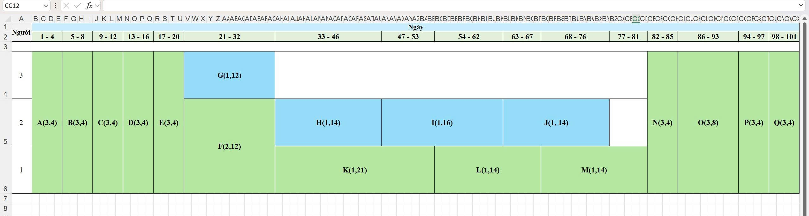

# CHƯƠNG 6: QUẢN LÝ NGUỒN NHÂN LỰC DỰ ÁN

## 6.1. Nguồn nhân lực

Nguồn nhân lực là một trong những yếu tố quan trọng quyết định đến sự thành công của dự án. Đối với dự án Nhà kính thông minh, nguồn nhân lực bao gồm tất cả các thành viên tham gia vào quá trình lập kế hoạch, phân tích yêu cầu, thiết kế hệ thống, xây dựng phần cứng, phát triển phần mềm, kiểm thử, triển khai và đánh giá kết quả dự án.

Mỗi thành viên được phân công nhiệm vụ dựa trên năng lực chuyên môn và vai trò trong dự án. Việc xác định rõ nguồn nhân lực giúp nhóm phân chia công việc hợp lý, tránh chồng chéo trách nhiệm, đồng thời tạo cơ sở để theo dõi tiến độ và đánh giá mức độ hoàn thành công việc của từng thành viên.

Bảng phân công nguồn nhân lực của dự án như sau:

Bảng phân công

| ID | Họ và tên | Nhiệm vụ |
| --- | --- | --- |
| 1 | Hoàng Minh Trí | - Tìm hiểu mô hình dự đoán; - Xây dựng dữ liệu mô phỏng;  - Tiền xử lý dữ liệu;  - Huấn luyện và đánh giá mô hình ARX. |
| 2 | Đinh Công Trung Sỹ | - Phụ trách phần cứng, thiết kế mạch và đấu nối ESP32; - Lập trình firmware ESP32;  - Điều khiển relay và truyền dữ liệu qua WebSocket; - Xây dựng website. |
| 3 | Ngô Quang Sinh | - Cài đặt Kalman Filter để lọc nhiễu cảm biến;  - Xây dựng bộ điều khiển MPC;  - Tích hợp pipeline AI điều khiển thiết bị. |

## 6.2. Một số quy tắc điều phối nguồn lực

Trong quá trình thực hiện dự án, thời gian và khả năng làm việc của từng thành viên là có giới hạn. Vì vậy, việc điều phối nguồn nhân lực cần được thực hiện hợp lý nhằm đảm bảo các công việc quan trọng được hoàn thành đúng tiến độ, hạn chế tình trạng một thành viên bị quá tải trong khi thành viên khác chưa được phân công phù hợp.

Một số quy tắc điều phối nguồn lực:

Công việc có thời gian dự trữ ít nhất được ưu tiên thực hiện trước. Đây là những công việc có ít thời gian linh động, nếu chậm trễ sẽ dễ ảnh hưởng đến tiến độ chung của dự án.

Khi các công việc có thời gian dự trữ ít như nhau thì ưu tiên cho công việc đang thực hiện. Việc tiếp tục hoàn thành công việc đang triển khai giúp hạn chế gián đoạn, giảm thời gian chuyển đổi giữa các nhiệm vụ và đảm bảo tiến độ thực hiện ổn định.

Khi các công việc ngang nhau về hai điều kiện trên thì ưu tiên cho công việc cần nguồn lực nhiều hơn. Những công việc này thường khó bố trí nhân sự hơn, vì vậy cần được sắp xếp hợp lý để tránh tình trạng thiếu hụt nguồn lực trong quá trình triển khai.

Khi các công việc ngang nhau về ba điều kiện trên thì ưu tiên cho công việc có mức sử dụng nguồn lực trong một đơn vị thời gian lớn nhất.

## 6.3. Sơ đồ phụ tải nguồn nhân lực

Bảng phân bố nguồn nhân lực

| AC | Hoạt động | Công việc trước đó | Thời lượng | Nhân lực (người) | Thành viên |
| --- | --- | --- | --- | --- | --- |
| A | Khảo sát các giải pháp nhà kính thông minh hiện có | - | 4 ngày | 3 | Cả nhóm |
| B | Xác định yêu cầu chức năng | A | 4 ngày | 3 | Cả nhóm |
| C | Xác định yêu cầu phi chức năng | B | 4 ngày | 3 | Cả nhóm |
| D | Xác định phạm vi và ràng buộc | C | 4 ngày | 3 | Cả nhóm |
| E | Thiết kế kiến trúc tổng thể HW + SW | D | 4 ngày | 3 | Cả nhóm |
| F | Thiết kế pipeline AI ARX - Kalman - MPC | E | 12 ngày | 2 | Trí, Sinh |
| G | Lắp ráp phần cứng mạch, cảm biến, relay, Solar Tracking | E | 12 ngày | 1 | Sỹ |
| H | Lập trình firmware ESP32 | G | 14 ngày | 1 | Sỹ |
| I | Phát triển Backend Django + WebSocket Server | H | 16 ngày | 1 | Sỹ |
| J | Phát triển Web Dashboard ReactJS | I | 14 ngày | 1 | Sỹ |
| K | Huấn luyện mô hình ARX | F | 21 ngày | 1 | Trí |
| L | Phát triển Kalman Filter | K | 14 ngày | 1 | Sinh |
| M | Phát triển MPC Controller | L | 14 ngày | 1 | Sinh |
| N | Tích hợp AI vào Web | J, M | 4 ngày | 3 | Cả nhóm |
| O | Kiểm thử tích hợp chức năng | N | 8 ngày | 3 | Cả nhóm |
| P | Hiệu chỉnh phần cứng và mô hình AI | O | 4 ngày | 3 | Cả nhóm |
| Q | Hoàn thành báo cáo và bảo vệ đồ án | P | 4 ngày | 3 | Cả nhóm |

Sơ đồ phụ tải nguồn nhân lực
