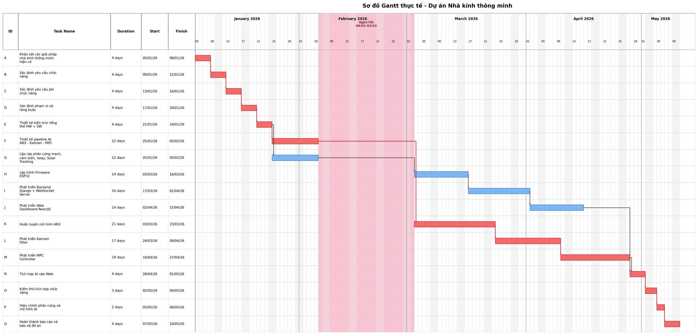

# CHƯƠNG 8: KIỂM SOÁT DỰ ÁN

## 8.1 Tổng quan về kiểm soát dự án

Kiểm soát dự án là quá trình theo dõi tiến độ, chi phí, chất lượng và phạm vi nhằm phát hiện sai lệch và điều chỉnh kịp thời.

Quy trình kiểm soát

| Bước | Nội dung | Mô tả |
| --- | --- | --- |
| 1 | Giám sát | Thu thập thông tin về tiến độ, chi phí, chất lượng, phạm vi |
| 2 | Phân tích vấn đề | So sánh KH vs thực tế, tính SV, CV, SPI, CPI |
| 3 | Kiểm soát thay đổi | Ghi nhận → phân tích tác động → phê duyệt |
| 4 | Thực hiện điều chỉnh | Sửa lịch biểu, bổ sung nhân lực, cắt giảm phạm vi |
| 5 | Kết thúc dự án | Nghiệm thu, thống kê, rút kinh nghiệm |

## 8.2 Thu thập và đánh giá hiện trạng

### 8.2.1 Mục đích thu thập hiện trạng

Thu thập hiện trạng là quá trình đo lường mức độ tiến triển của dự án so với kế hoạch ban đầu, nhằm:

Xác định công việc nào đã hoàn thành, đang thực hiện, chưa bắt đầu.

Phát hiện sớm các sai lệch về thời gian, chi phí, chất lượng.

Cung cấp cơ sở để ra quyết định điều chỉnh kịp thời.

### 8.2.2 Time sheet nhiệm vụ

TimeSheet nhiệm vụ

| AC | WBS | Công việc | KH bắt đầu | KH kết thúc | TT bắt đầu | TT kết thúc | % Hoàn thành | Ghi chú |
| --- | --- | --- | --- | --- | --- | --- | --- | --- |
| A | T1.1 | Khảo sát các giải pháp nhà kính thông minh hiện có | 05/01 | 08/01 | 05/01 | 08/01 | 100% | Đúng tiến độ |
| B | T1.2 | Xác định yêu cầu chức năng | 09/01 | 12/01 | 09/01 | 12/01 | 100% | Đúng tiến độ |
| C | T1.3 | Xác định yêu cầu phi chức năng | 13/01 | 16/01 | 13/01 | 16/01 | 100% | Đúng tiến độ |
| D | T1.4 | Xác định phạm vi và ràng buộc | 17/01 | 20/01 | 17/01 | 20/01 | 100% | Đúng tiến độ |
| E | T2.1 - T2.5 | Thiết kế kiến trúc tổng thể HW + SW | 21/01 | 24/01 | 21/01 | 24/01 | 100% | Đúng tiến độ |
| F | T2.6 | Thiết kế pipeline AI ARX - Kalman - MPC | 25/01 | 05/02 | 25/01 | 05/02 | 100% | Đúng tiến độ |
| G | T3.1 | Lắp ráp phần cứng mạch, cảm biến, relay, Solar Tracking | 25/01 | 05/02 | 25/01 | 05/02 | 100% | Đúng tiến độ |
| - | Nghỉ Tết Nguyên Đán | 09/02 | 02/03 | 09/02 | 02/03 | - | - | Nghỉ toàn dự án |
| H | T3.2 | Lập trình firmware ESP32 | 03/03 | 16/03 | 03/03 | 16/03 | 100% | Đúng tiến độ |
| I | T3.3 | Phát triển Backend Django + WebSocket Server | 17/03 | 01/04 | 17/03 | 01/04 | 100% | Đúng tiến độ |
| J | T3.4 | Phát triển Web Dashboard ReactJS | 02/04 | 15/04 | 02/04 | 15/04 | 100% | Đúng tiến độ |
| K | T3.5 | Huấn luyện mô hình ARX | 03/03 | 23/03 | 03/03 | 23/03 | 100% | Đúng tiến độ |
| L | T3.6 | Phát triển Kalman Filter | 24/03 | 06/04 | 24/03 | 09/04 | 100% | Trễ 3 ngày do xử lý nhiễu cảm biến |
| M | T3.7 | Phát triển MPC Controller | 07/04 | 20/04 | 10/04 | 27/04 | 100% | Trễ do tuning MPC |
| N | T3.8 | Tích hợp AI vào Web | 21/04 | 24/04 | 28/04 | 01/05 | 100% | Dời theo tiến độ MPC |
| O | T4.1 - T4.3 | Kiểm thử tích hợp chức năng | 25/04 | 02/05 | 02/05 | 04/05 | 100% | Rút ngắn để bù tiến độ |
| P | T5.1 | Hiệu chỉnh phần cứng và mô hình AI | 03/05 | 06/05 | 05/05 | 06/05 | 100% | Rút ngắn nhưng vẫn đạt yêu cầu |
| Q | T5.2 | Hoàn thành báo cáo và bảo vệ đồ án | 07/05 | 10/05 | 07/05 | 10/05 | 100% | Đúng mốc kết thúc |

### 8.2.3 Phân tích sai biệt

a) Sai biệt lịch biểu (Schedule Variance — SV)

Sai biệt lịch biểu

| Giai đoạn | KH (tuần) | TT (tuần) | SV | Đánh giá |
| --- | --- | --- | --- | --- |
| Phân tích yêu cầu | 2 | 2 | 0 | Đúng |
| Thiết kế | 2 | 3 | -1 | Trễ |
| Phát triển HW + FW | 3 | 3 | 0 | Đúng |
| Phát triển Backend | 5 | 5 | 0 | Đúng |
| Phát triển AI | 7 | 8 | -1 | Trễ |
| Phát triển Web | 7 | 7 | 0 | Đúng |
| Kiểm thử | 3 | 2 | +1 | Nhanh hơn |
| Tổng dự án | 15 | 15 | 0 | Đúng tổng thể |

Nhận xét: Dự án có 2 giai đoạn trễ (thiết kế và AI), nhưng bù lại bằng việc kiểm thử nhanh hơn. Tổng thời gian dự án vẫn đúng 15 tuần.

b) Sai biệt chi phí (Cost Variance — CV)

Sai biệt chi phí

| STT | Danh mục linh kiện / Hạng mục | KH (VNĐ) | TT (VNĐ) | Sai lệch (CV) | Lý do chênh lệch |
| --- | --- | --- | --- | --- | --- |
| 1 | ESP32 DevKit V1 | 95.000 | 105.000 | -10.000 | Biến động giá thị trường & phí ship |
| 2 | Màn hình LCD I2C 16×2 | 70.000 | 70.000 | 0 | Đúng dự toán |
| 3 | Cảm biến (DHT22 + Soil + LDR) | 70.000 | 86.000 | -16.000 | Biến động giá thị trường & phí ship |
| 4 | Relay + Bơm ×2 + Quạt + Phun sương + LED | 210.000 | 210.000 | 0 | Đúng dự toán |
| 5 | Mô hình + Breadboard + Dây + Nguồn | 240.000 | 265.000 | -25.000 | Mua thêm dây cắm test và phụ kiện phát sinh |
| 6 | Tấm pin NLMT 6V 5-7W | 130.000 | 130.000 | 0 | Đúng dự toán |
| 7 | Pin 18650 ×2 + Sạc TP4056 + Đốc pin | 160.000 | 160.000 | 0 | Đúng dự toán |
| 8 | Servo SG90 ×2 | 60.000 | 60.000 | 0 | Đúng dự toán |
| 9 | LDR ×4 + Trở 10kΩ ×4 + Relay 1 kênh ×3 | 100.000 | 100.000 | 0 | Đúng dự toán |
| 10 | Công tắc nguồn ON/OFF + Cáp USB | 65.000 | 65.000 | 0 | Đúng dự toán |
| 11 | Cảm biến DHT22 (Thay thế linh kiện hỏng) | 0 | 60.000 | -60.000 | Dùng quỹ dự phòng thay cảm biến hỏng ở tuần 5 |
| 12 | Chi phí vận chuyển phát sinh hỏa tốc | 0 | 60.000 | -60.000 | Ship hỏa tốc cảm biến và thiết bị dự phòng |
|  | Tổng kinh phí | 1.200.000 | 1.371.000 | -171.000 | Vượt 14.25% so với dự toán |

Nhận xét: Chi phí thực tế vượt 171.000 VNĐ (14.25%) so với kế hoạch ban đầu. Tuy nhiên, phần chi phí phát sinh này đã được bù đắp hoàn toàn bởi quỹ dự phòng rủi ro của dự án.

### 8.2.4 Quản lý giá trị thu được (EVM — Earned Value Management)

EVM là phương pháp đo lường hiệu suất dự án bằng cách kết hợp phạm vi, thời gian và chi phí.

Các chỉ số cơ bản:

PV (Planned Value): Giá trị công việc theo kế hoạch tại thời điểm đánh giá.

EV (Earned Value): Giá trị công việc đã hoàn thành thực tế.

AC (Actual Cost): Chi phí thực tế đã bỏ ra.

Bảng các chỉ số phân tích giá trị thu được

| Chỉ số | Công thức | Ý nghĩa | Đánh giá |
| --- | --- | --- | --- |
| SV | EV − PV | Sai biệt tiến độ | SV > 0: nhanh hơn KH; SV < 0: chậm hơn KH |
| CV | EV − AC | Sai biệt chi phí | CV > 0: tiết kiệm; CV < 0: vượt chi phí |
| SPI | EV / PV | Chỉ số hiệu suất tiến độ | SPI > 1: nhanh; SPI < 1: chậm |
| CPI | EV / AC | Chỉ số hiệu suất chi phí | CPI > 1: tiết kiệm; CPI < 1: lãng phí |

Áp dụng EVM cho dự án Smart Greenhouse (tại tuần 10):

Áp dụng EVM theo giờ công, tổng khối lượng kế hoạch của dự án là BAC = 502h.

Áp dụng EVM cho tuần 10

| Chỉ số | Giá trị | Diễn giải |
| --- | --- | --- |
| PV | ~70% × 502h = 351h | Theo KH, tuần 10 phải hoàn thành 70% |
| EV | ~65% × 502h = 326h | Thực tế hoàn thành 65% (AI đang trễ) |
| AC | 343h | Công sức thực tế đã bỏ ra |
| SV | 326 − 351 = −25h | Chậm tiến độ |
| CV | 326 − 343 = −17h | Vượt chi phí nhân công |
| SPI | 326/351 = 0.93 | Chậm 7% so với KH |
| CPI | 326/343 = 0.95 | Chi phí vượt 5% |

Nhận xét: SPI = 0.93 cho thấy dự án chậm 7% tại tuần 10, chủ yếu do module MPC. Sau can thiệp (tăng giờ C, A hỗ trợ), dự án đã hoàn thành đúng hạn tuần 15.

Ngưỡng cảnh báo: Hầu hết tổ chức đặt ngưỡng khi CPI hoặc SPI nằm ngoài khoảng 0.90–1.10. Khi vượt ngưỡng → yêu cầu phân tích nguyên nhân và báo cáo giải trình.

### 8.2.5 Dự báo EVM (EAC, ETC, VAC)

Công thức các chỉ số dự báo

| Chỉ số | Công thức | Ý nghĩa |
| --- | --- | --- |
| EAC | BAC ÷ CPI | Tổng chi phí dự kiến khi hoàn thành |
| ETC | EAC − AC | Chi phí cần thêm để hoàn thành phần việc còn lại |
| VAC | BAC − EAC | Chênh lệch dự kiến giữa ngân sách và tổng chi phí cuối cùng |

Áp dụng cho dự án (tại tuần 10):

Dự báo EVM cho tuần 10

| Chỉ số | Tính toán | Diễn giải |
| --- | --- | --- |
| EAC | 1.200.000 ÷ 0.95 =1.263.158 VNĐ | Dự kiến chi phí tổng khi hoàn thành |
| ETC | 1.263.158 − 1.371.000 × (10/15) =349.158 VNĐ | Chi phí cần thêm cho phần còn lại |
| VAC | 1.200.000 − 1.263.158 =−63.158 VNĐ | Dự kiến vượt ngân sách ~5.3% |

Các công thức EAC khác (tùy tình huống):

EAC = AC + (BAC − EV) → Giả định: công việc còn lại sẽ đúng ngân sách.

EAC = AC + [(BAC − EV) ÷ (CPI × SPI)]→ Giả định:Chi phí và tiến độ đều ảnh hưởng.

## 8.3 Phát hiện và giải quyết vấn đề

### 8.3.1 Phân tích nguyên nhân gốc (Phương pháp 5 Whys)

Đặt câu hỏi 5 Whys

| Lần | Câu hỏi | Trả lời |
| --- | --- | --- |
| 1 | Tại sao module AI & điều khiển bị trễ? | Vì thành viên C gặp khó khăn khi lập trình bộ điều khiển MPC |
| 2 | Vì sao C gặp khó khăn khi lập trình MPC? | Vì mô hình ARX free-run bị tích lũy sai số lớn |
| 3 | Vì sao mô hình ARX bị sai số tích lũy? | Vì dữ liệu cảm biến đầu vào bị nhiễu mạnh |
| 4 | Vì sao không xử lý lọc nhiễu ngay từ đầu? | Vì chưa xây dựng bộ lọc Kalman Filter |
| 5 | Nguyên nhân gốc | Thiếu giải pháp lọc nhiễu cảm biến và tối ưu dự báo ngắn hạn |

### 8.3.2 Bảng theo dõi và giải quyết vấn đề thực tế

Trong quá trình phát triển hệ thống nhà kính thông minh, nhóm ghi nhận và xử lý nhiều vấn đề thực tế phát sinh như lỗi mô hình AI, trễ tiến độ, hỏng cảm biến và mất kết nối WebSocket. Các vấn đề đều được theo dõi thông qua Issue Log nhằm đảm bảo kiểm soát tiến độ và chất lượng hệ thống.

Theo dõi và giải quyết vấn đề thực tế

| ID | Vấn đề phát sinh | Giai đoạn | Biện pháp xử lý | Trạng thái |
| --- | --- | --- | --- | --- |
| VĐ01 | Sai số lớn trong mô hình ARX và dữ liệu cảm biến nhiễu | Tuần 5–8 | Áp dụng Adaptive Kalman Filter và Receding Horizon | Đã xử lý |
| VĐ02 | Trễ tiến độ module MPC | Tuần 9–10 | Tăng giờ làm việc của C, A hỗ trợ dữ liệu mô phỏng ARX và B hỗ trợ kiểm thử tích hợp | Đã xử lý |
| VĐ03 | Cảm biến DHT22 bị hỏng | Tuần 11 | Thay thế cảm biến dự phòng và hiệu chuẩn lại | Đã xử lý |
| VĐ04 | Mất kết nối WebSocket giữa ESP32 và Server | Tuần 12 | Bổ sung Auto-reconnect và buffer dữ liệu | Đã xử lý |

## 8.4 Họp

### 8.4.1 Họp định kỳ

Tần suất: 1 lần/tuần (thứ 7 hoặc Chủ nhật).

Thời lượng: 30–60 phút.

Hình thức: Trực tiếp hoặc online (GG Meet).

Nội dung:

Báo cáo tiến độ tuần qua (mỗi người 5 phút).

Thảo luận vấn đề gặp phải.

Lập kế hoạch tuần tới.

Review rủi ro (nếu cần).

### 8.4.2 Họp đột xuất

Họp đột xuất được triệu tập khi:

Phát hiện bug nghiêm trọng ảnh hưởng nhiều module.

Cần thay đổi thiết kế/yêu cầu gấp.

Chuẩn bị demo cho giảng viên.

## 8.5 Điều chỉnh

### 8.5.1 Khi dự án không đúng lịch biểu

Trong dự án Smart Greenhouse, giai đoạn Phát triển AI bị trễ 1 tuần (MPC tuning phức tạp hơn dự kiến).

Biện pháp đã áp dụng:

Tăng giờ làm việc của thành viên C (từ 20h → 28h/tuần trong tuần 9–10).

Sử dụng dữ liệu mô phỏng để huấn luyện song song, không chờ dữ liệu thực.

B hỗ trợ kiểm thử phần tích hợp ESP32 ↔ Backend trong khi C tập trung MPC.

### 8.5.2 Khi chi phí có nguy cơ tăng

Chi phí vượt 171.000 VNĐ (14.25%) do biến động giá thị trường, mua thêm dây cắm, thay cảm biến hỏng và phí ship hỏa tốc.

Biện pháp:

Sử dụng kinh phí dự phòng đã dự trù (255.000 VNĐ).

Tổng chi phí thực tế (1.371.000 VNĐ) vẫn nằm trong ngân sách tổng (1.200.000 + 255.000 = 1.455.000 VNĐ).

## 8.6 Kiểm soát thay đổi

### 8.6.1 Nguồn gốc thay đổi

Nguồn gốc thay đổi

| Nguồn | Ví dụ |
| --- | --- |
| Giảng viên (khách hàng) | Yêu cầu thêm chức năng cảnh báo ngưỡng |
| Nhóm phát triển | Phát hiện cần thêm Adaptive Kalman thay Kalman cơ bản |
| Môi trường kỹ thuật | Cảm biến hỏng → thay đổi cách đọc dữ liệu |

### 8.6.2 Phân loại thay đổi

Phân loại thay đổi

| Loại | Mô tả | Ví dụ |
| --- | --- | --- |
| Quan trọng | Ảnh hưởng đến kiến trúc/tiến độ tổng thể | Thêm MPC vào hệ thống |
| Ít quan trọng | Thay đổi nhỏ, không ảnh hưởng tiến độ | Đổi màu giao diện |
| Bổ sung | Tính năng mới ngoài phạm vi ban đầu | Thêm trang dự báo xu hướng |

### 8.6.3 Nhật ký kiểm soát thay đổi

Nhật ký kiểm soát thay đổi

| STT | Ngày | Mô tả thay đổi | Trách nhiệm | Loại | Tác động | Quyết định |
| --- | --- | --- | --- | --- | --- | --- |
| 1 | Tuần 3 | Bổ sung và hoàn thiện nội dung thiết kế pipeline AI gồm ARX, Kalman Filter và MPC | A, C | Quan trọng | Hoạt động F hoàn thành đúng kế hoạch trong giai đoạn 25/01-05/02, không phát sinh trễ | Chấp nhận |
| 2 | Tuần 8-9 | Kéo dài phát triển Kalman Filter để xử lý nhiễu cảm biến | C | Quan trọng | Hoạt động L kéo dài đến 09/04 | Chấp nhận |
| 3 | Tuần 9-10 | Điều chỉnh tiến độ MPC Controller do tuning phức tạp hơn dự kiến | C | Quan trọng | Hoạt động M dời thành 10/04-27/04, kéo theo N dời sang 28/04-01/05 | Chấp nhận |
| 4 | Tuần 12-13 | Rút ngắn kiểm thử tích hợp và hiệu chỉnh để bù tiến độ | A, B, C | Điều chỉnh tiến độ | O và P được rút ngắn nhưng vẫn đảm bảo kiểm thử các chức năng chính | Chấp nhận |
| 5 | Tuần 11 | Thay cảm biến DHT22 hỏng bằng cảm biến dự phòng | B | Ít quan trọng | Phát sinh 60.000 VNĐ chi phí, không làm trễ mốc cuối | Chấp nhận |

GANTT thực tế sau kiểm soát thay đổi

## 8.7 Kết thúc dự án

### 8.7.1 Các lý do kết thúc

Dự án kết thúc vì hoàn thành mục tiêu đề ra trong thời gian quy định (15 tuần). Tất cả kết quả đã được chuyển giao:

Hệ thống phần cứng hoạt động.

Firmware ESP32 ổn định.

Backend + AI tích hợp thành công.

Web Dashboard đầy đủ.

Báo cáo PBL + QLDA hoàn thành.

### 8.7.2 Thống kê số liệu

Số liệu thống kê khi kết thúc dự án

| Hạng mục | Giá trị |
| --- | --- |
| Tổng thời gian | 15 tuần |
| Tổng giờ công | 502 giờ (A: 146h, B: 245h, C: 111h) |
| Tổng chi phí | 1.371.000 VNĐ |
| Số work packages | 23 |
| Số mốc | 9 |
| Số thay đổi | 5 |
| Số rủi ro xảy ra | 2 (R05: cảm biến hỏng, R02: trễ AI) |

### 8.8.3 So sánh kế hoạch vs thực tế

So sánh số liệu kế hoạch với thực tế khi kết thúc dự án

| Tiêu chí | Kế hoạch | Thực tế | Sai lệch |
| --- | --- | --- | --- |
| Thời gian tổng | 15 tuần | 15 tuần | 0 |
| Chi phí | 1.200.000 VNĐ | 1.371.000 VNĐ | +14.25% |
| FIT 1-step ARX | ≥ 80% | 85,85% | +5,85% |
| FIT free-run | ≥ 60% | 66,42% | +6,42% |
| RMSE free-run | ≤ 1.5 | 0,978 | Tốt hơn |
| MPC vùng mục tiêu | 55–65% | Đạt | Đạt |
| Giai đoạn trễ | 0 | 2 (thiết kế, AI) |  |

### 8.8.4 Lưu trữ hồ sơ dự án

Toàn bộ hồ sơ dự án được lưu trữ tại:

GitHub Repository: Mã nguồn (firmware, backend, web, AI).

Google Drive: Báo cáo, slide, biên bản họp, nhật ký thay đổi.

Trello Board: Lịch sử quản lý công việc.
