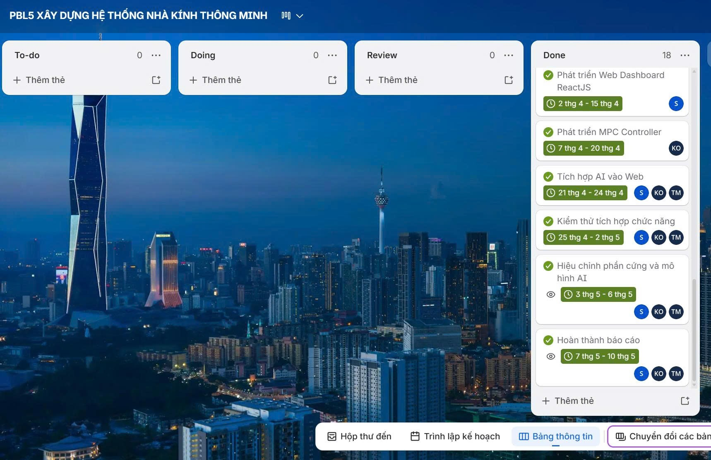
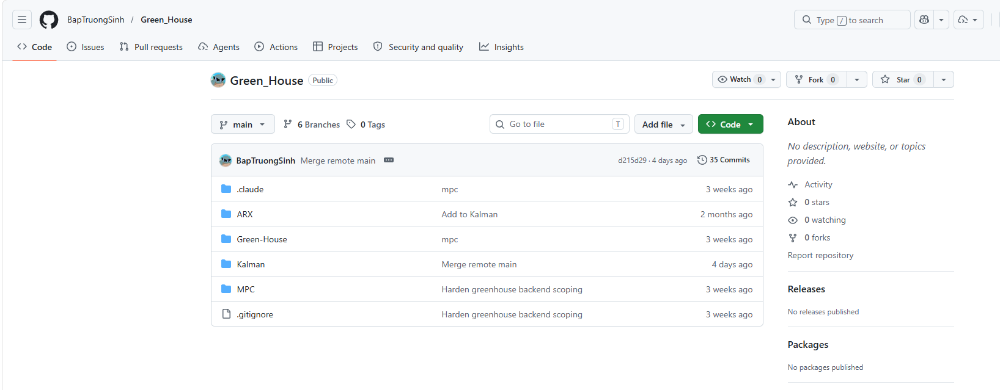
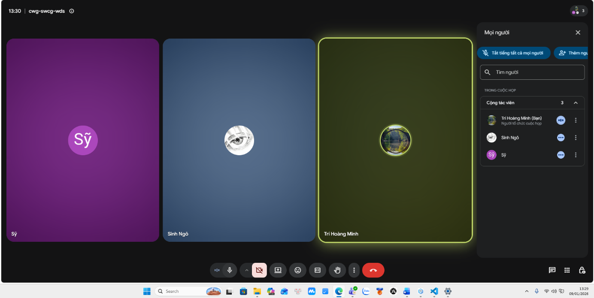
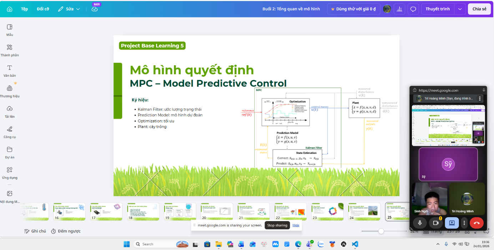
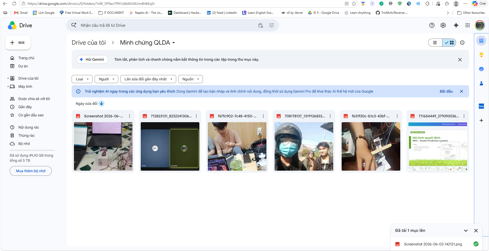

# CÁC CÔNG CỤ KIỂM SOÁT

1. Công cụ quản lý các công việc dự án: Trello

Trello là công cụ được nhóm sử dụng để quản lý công việc và theo dõi tiến độ trong quá trình thực hiện dự án PBL5. Thông qua Trello, các công việc được tổ chức dưới dạng các thẻ nhiệm vụ và sắp xếp theo từng danh sách trạng thái khác nhau.

Quản lý công việc bằng Trello

2. Công cụ kiểm soát mã nguồn: Git và Github

Git và GitHub được sử dụng để quản lý mã nguồn dự án nhằm lưu trữ lịch sử phát triển, hỗ trợ làm việc nhóm song song, hạn chế xung đột mã nguồn và kiểm soát chất lượng thông qua Pull Request, Code Review cũng như các bước kiểm thử tự động trước khi triển khai.

Công cụ quản lý mã nguồn Github

3. Quản lý cuộc họp

Xác định các yêu cầu bài toán (9/1/2026)

Làm slide tổng quan các mô hình (24/1/2026)

4. Quản lý minh chứng

Sử dụng google drive để lưu ảnh đi làm nhóm.

Quản lý minh chứng bằng drive
