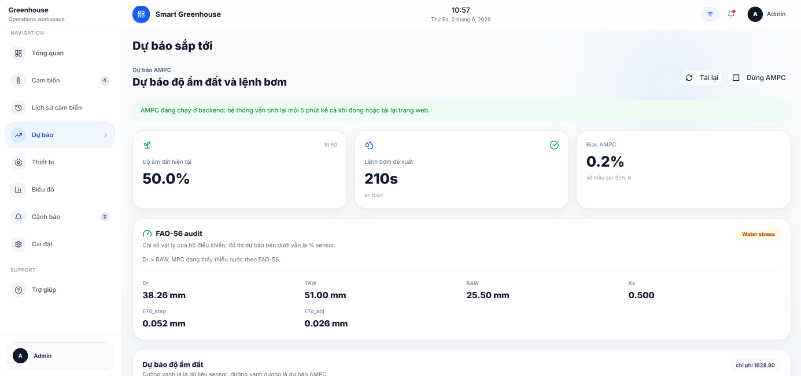
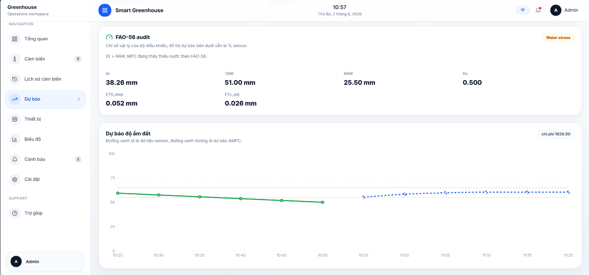
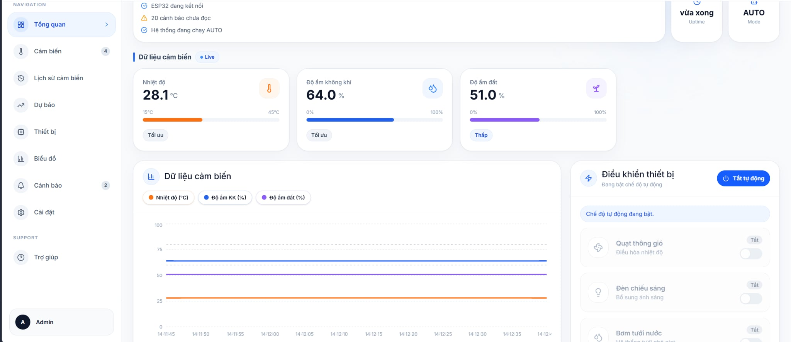
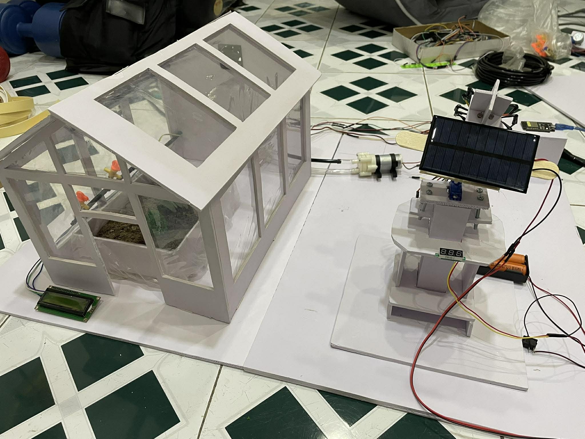

# KẾT QUẢ DỰ ÁN

1. Trang dự báo độ ẩm đất

Các chỉ số vật lý và lệnh bơm đề xuất

Biểu đồ dự báo độ ẩm đất

Ý nghĩa: Hệ thống sử dụng mô hình ARX để dự báo độ ẩm đất trong các bước thời gian tiếp theo dựa trên dữ liệu cảm biến hiện tại, sau đó đưa kết quả dự báo vào MPC Controller nhằm tính toán thời gian bơm và chiến lược điều khiển tối ưu.

Dashboard đồng thời hiển thị dữ liệu cảm biến thời gian thực, thông số FAO-56 và biểu đồ dự báo độ ẩm đất để hỗ trợ giám sát và tối ưu hóa việc tưới tiêu trong nhà kính thông minh.

2. Trang theo dõi các chỉ số nhà kính

Các chỉ số nhà kính

3. Kết quả phần cứng của dự án

Kết quả phần cứng
